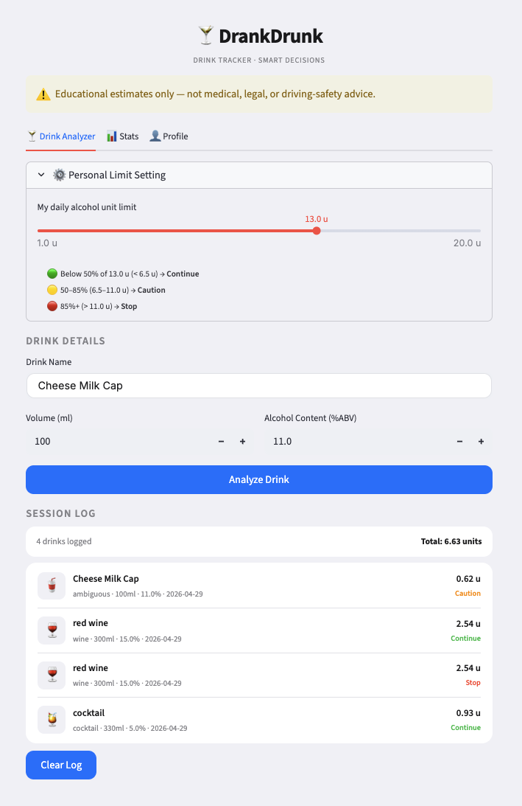
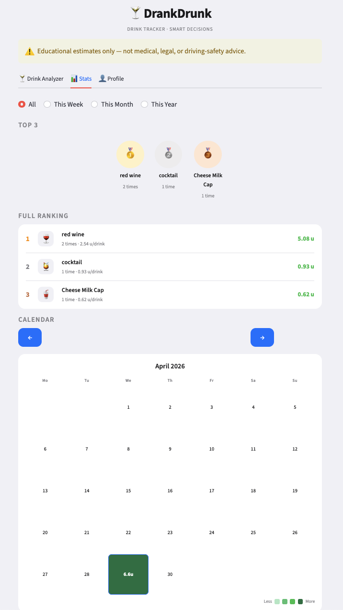
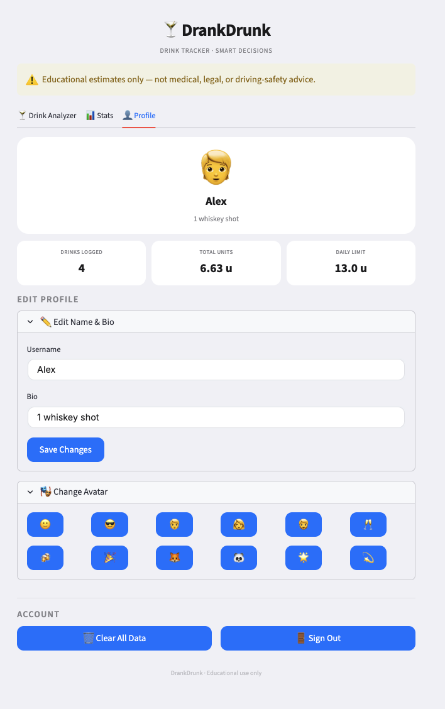

# DrankDrunk: AI Alcohol Intake Decision Assistant

## 1. Context, User, and Problem

DrankDrunk is a small GenAI application designed for urban professionals who drink socially and want a low-friction way to estimate alcohol intake in real time.

The workflow I am improving is alcohol intake tracking and decision-making. In the current manual workflow, users need to remember drink size, alcohol percentage, quantity, and then estimate their intake manually. This is inconvenient, especially in a social setting.

The problem matters because alcohol decisions often happen quickly and informally. A simple tool that converts natural-language drink descriptions into estimated alcohol units can help users slow down, reflect, and make safer choices.

## 2. Solution and Design

I built a Streamlit app that allows users to enter drink descriptions in natural language, such as:

- `beer 500ml`
- `whiskey shot`
- `2 beers and 1 whiskey`
- `a couple drinks`

The app uses a language model to classify the drink type and normalize the input into structured JSON. Then, a rule-based calculation estimates alcohol units and produces one of three safety recommendations:

- Continue
- Caution
- Stop

The system design has five steps:

1. User enters a free-text drink description.
2. The LLM converts the input into structured JSON.
3. The app calculates estimated alcohol units.
4. The app applies decision rules.
5. The app saves the result into a simple lifestyle log.

The main GenAI design choice is structured output. The LLM is instructed to return only valid JSON with drink category, estimated ABV, volume, quantity, and confidence level. This makes the output easier to evaluate and safer to use in downstream logic.

GenAI is useful for this task because real drink inputs are often vague or inconsistent. The goal is not medical accuracy, but lightweight decision support during informal social situations.

The project intentionally uses a simple architecture:

- one Streamlit app
- one LLM
- rule-based calculations

A retrieval system (RAG), multi-agent workflow, or external database would add complexity without improving this narrow workflow. A spreadsheet or form-based baseline requires rigid input, while this app can handle natural expressions such as “a couple drinks” or “one strong cocktail.”

## 3. Evaluation and Results

I evaluated the app using a fixed test set of 20 realistic drink inputs. The test set included simple drinks, cocktails, mixed drinks, and ambiguous inputs.

The baseline was manual spreadsheet tracking. In the baseline workflow, users manually enter drink type, ABV, volume, and quantity before calculating alcohol intake.

Evaluation dimensions:

### What Counted as Good Output

A good output needed to satisfy three conditions:

1. The drink category is reasonable.
2. The alcohol-unit estimate is close enough for educational use.
3. The decision cue matches the expected intake level.

### Evaluation Cases

| Test Input | Expected Category | Expected Units | Expected Decision |
| --- | --- | --- | --- |
| beer 500ml | beer | 1.0 | Continue |
| one glass of wine | wine | 1.2 | Continue |
| whiskey shot | spirit | 1.0 | Continue |
| 2 beers | mixed | 2.0 | Caution |
| 2 beers and 1 whiskey shot | mixed | 3.0 | Caution |
| 3 margaritas | cocktail | 4.5 | Stop |
| mojito | cocktail | 1.3 | Continue |
| a couple drinks | ambiguous | 2.0 | Caution |
| vodka soda | spirit | 1.2 | Continue |
| several drinks | ambiguous | 3.0 | Caution |

### Baseline Comparison

| Dimension | Manual Spreadsheet Baseline | DrankDrunk App |
| --- | --- | --- |
| Input effort | User manually fills multiple structured fields | User types natural-language drink descriptions |
| Flexibility | Requires exact values | Handles informal language |
| Speed | Slower in social settings | Faster for common drinks |
| Reliability | Strong with exact measurements | Strong for common drinks, weaker for vague inputs |

### Example Walkthrough

Input:

```text
2 beers and 1 whiskey shot

Output:

Estimated alcohol units: 3.0
Decision: Caution
Session total updated automatically

This demonstrates the workflow:

natural-language input → structured parsing → alcohol estimation → decision support

Examples of difficult inputs include:

- “several drinks”
- “one strong cocktail”
- “homemade mixed drink”

These descriptions are difficult because the alcohol percentage, serving size, or quantity may be unclear.

Human judgment is still necessary whenever drink details are uncertain. The app should be treated as a lightweight reflection tool rather than an authority on alcohol safety.

### What Counted as Good Output

A good output needed to satisfy three conditions:

1. The drink category is reasonable.
2. The alcohol-unit estimate is close enough for educational use.
3. The decision cue matches the expected intake level.

### Evaluation Cases

| Test Input | Expected Category | Expected Units | Expected Decision |
|---|---|---|---|
| beer 500ml | beer | 1.0 | Continue |
| one glass of wine | wine | 1.2 | Continue |
| whiskey shot | spirit | 1.0 | Continue |
| 2 beers | mixed | 2.0 | Caution |
| 2 beers and 1 whiskey shot | mixed | 3.0 | Caution |
| 3 margaritas | cocktail | 4.5 | Stop |
| mojito | cocktail | 1.3 | Continue |
| a couple drinks | ambiguous | 2.0 | Caution |
| vodka soda | spirit | 1.2 | Continue |
| several drinks | ambiguous | 3.0 | Caution |

### Baseline Comparison

| Dimension | Manual Spreadsheet Baseline | DrankDrunk App |
|---|---|---|
| Input effort | User manually fills multiple structured fields | User types natural-language drink descriptions |
| Flexibility | Requires exact values | Handles informal language |
| Speed | Slower in social settings | Faster for common drinks |
| Reliability | Strong with exact measurements | Strong for common drinks, weaker for vague inputs |

### Example Walkthrough

Input:

```text
2 beers and 1 whiskey shot
```

Output:

- Estimated alcohol units: 3.0
- Decision: Caution
- Session total updated automatically

This demonstrates the workflow:

natural-language input → structured parsing → alcohol estimation → decision support

## 4. Artifact Snapshot

This section demonstrates how the application works through real examples.

---

### Example 1: Drink Input & Unit Calculation

Users can manually input drink details, including volume (ml) and alcohol content (%ABV).

Example:

- Drink: Cheese Milk Cap  
- Volume: 100 ml  
- Alcohol Content: 11%  

The system calculates alcohol units directly from these values, ensuring transparency and accuracy without relying on predefined drink categories.

This design allows flexibility for real-world drinks with varying compositions.



---

### Example 2: Session Tracking & Decision Feedback

The system logs each drink within a session and continuously updates total alcohol intake.

Key features:

- Real-time cumulative alcohol units  
- Per-drink breakdown (volume, ABV, timestamp)  
- Immediate decision feedback (Continue / Caution / Stop)

This supports a clear workflow:
input → calculate → accumulate → decision → feedback

The system helps users make safer decisions based on their current intake level.


---

### Example 3: Statistics & User Behavior Insights

The statistics dashboard provides insights into drinking behavior over time.

Key features:

- Most frequently consumed drinks  
- Total alcohol units per category  
- Calendar-based consumption patterns  

This transforms raw tracking data into meaningful behavioral insights, supporting long-term awareness.



---

### Example 4: Personalized Profile & Limits

The system includes a simple profile and personalization feature:

- Custom username and avatar  
- Adjustable daily alcohol limit  
- Session summary metrics  

The personal limit directly influences decision thresholds:

- Below 50% → Continue
- 50–85% → Caution  
- Above 85% → Stop  

This demonstrates a personalized workflow tailored to individual users.



## 5. Setup and Usage Instructions

### Install Dependencies

```bash
pip install -r requirements.txt
```

### Add API Key

Create a `.env` file:

```bash
OPENAI_API_KEY=your_api_key_here
```

### Run the App

```bash
streamlit run app.py
```

### Suggested Example Inputs

```text
beer 500ml
whiskey shot
2 beers and 1 whiskey shot
one strong cocktail
```

---

## 6. Project Limitations

This project intentionally uses a simple design.

It does not use:

- RAG
- multiple models
- agents

because those features are unnecessary for this workflow.

The main limitation is uncertainty in real-world drink descriptions.

The app supports lightweight estimation and reflection, but it should not replace human judgment.
